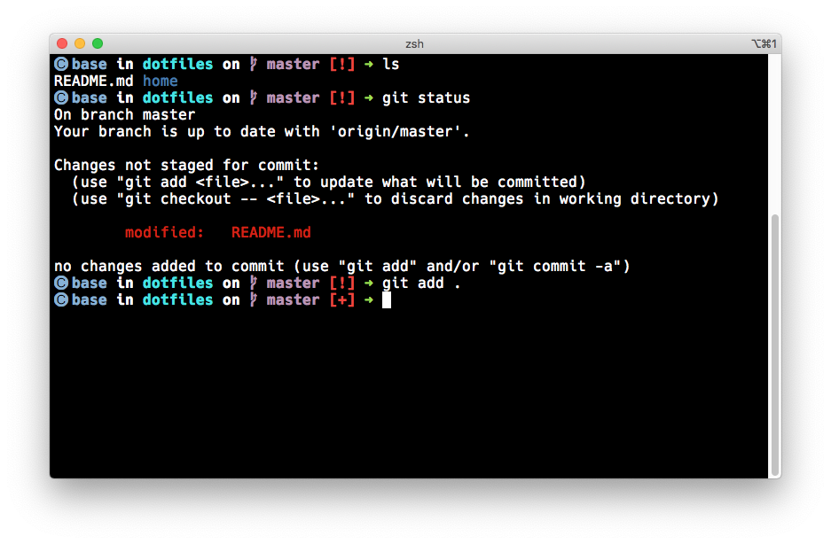

# My homeshick dotfiles repo

## Requirements

- [zsh](www.zsh.org)*
- [prezto](https://github.com/sorin-ionescu/prezto)
- [homeshick](https://github.com/andsens/homeshick)
- [spaceship-prompt](https://github.com/denysdovhan/spaceship-prompt)

\* Install via Linux distro package manager or [Homebrew](https://brew.sh) on MacOS

## Supported Software

- [apparix, in its 100% shell flavour](https://github.com/micans/apparix/) (completion available out of the box)
- [miniconda](https://docs.conda.io/en/latest/miniconda.html) (completion available out of the box, see [here](https://github.com/esc/conda-zsh-completion) to update)

\* Install via Linux distro package manager or [Homebrew](https://brew.sh) on MacOS

## Additional configuration details

### Quick restore (on MacOS)

1. Install zsh
   ```
   $ brew install zsh
   ```
2. Install prezto
   ```
   zsh
   ```
   ```
   git clone --recursive https://github.com/sorin-ionescu/prezto.git "${ZDOTDIR:-$HOME}/.zprezto"
   ```
   ```
   setopt EXTENDED_GLOB
   for rcfile in "${ZDOTDIR:-$HOME}"/.zprezto/runcoms/^README.md(.N); do
       ln -s "$rcfile" "${ZDOTDIR:-$HOME}/.${rcfile:t}"
   done
   ```
   ```
   chsh -s /bin/zsh
   ```
3. Install homeshick
   ```
   git clone git://github.com/andsens/homeshick.git $HOME/.homesick/repos/homeshick
   ```
4. Install spaceship-prompt
   ```
   cd $ZPREZTODIR
   git clone --recurse-submodules https://github.com/belak/prezto-contrib contrib
   ```
5. [Sync the homeshick castle](https://github.com/andsens/homeshick/wiki/Tutorials#adding-other-machines)
   ```
   $HOME/.homesick/repos/homeshick/bin/homeshick clone momom4urice/dotfiles
   ```

### Disable Conda's prompt modifications

If Conda's PS1 modifications annoy you (might be the case if you use the spaceship-prompt), edit `~/.condarc` and add the following lines:
```yaml
changeps1: False
```
See [here](https://conda.io/projects/conda/en/latest/user-guide/configuration/use-condarc.html#change-command-prompt-changeps1) for more detail.

### spaceship-prompt configuration



- Terminal emulator: iTerm2
- Color scheme: Tango Dark
- Prompt configuration:
  ```bash
  ZSH_THEME="spaceship"
  SPACESHIP_PROMPT_ADD_NEWLINE=false
  SPACESHIP_PROMPT_SEPARATE_LINE=false
  SPACESHIP_PROMPT_ORDER=(
  venv          # virtualenv section
  conda         # conda virtualenv section
  pyenv         # Pyenv section
  time          # Time stamps section
  user          # Username section
  host          # Hostname section
  dir           # Current directory section
  git           # Git section (git_branch + git_status)
  hg            # Mercurial section (hg_branch  + hg_status)
  package       # Package version
  node          # Node.js section
  ruby          # Ruby section
  elixir        # Elixir section
  xcode         # Xcode section
  swift         # Swift section
  golang        # Go section
  php           # PHP section
  rust          # Rust section
  haskell       # Haskell Stack section
  julia         # Julia section
  docker        # Docker section
  aws           # Amazon Web Services section
  dotnet        # .NET section
  ember         # Ember.js section
  kubecontext   # Kubectl context section
  terraform     # Terraform workspace section
  exec_time     # Execution time
  line_sep      # Line break
  battery       # Battery level and status
  vi_mode       # Vi-mode indicator
  jobs          # Background jobs indicator
  exit_code     # Exit code section
  char          # Prompt character
  )
  ```
